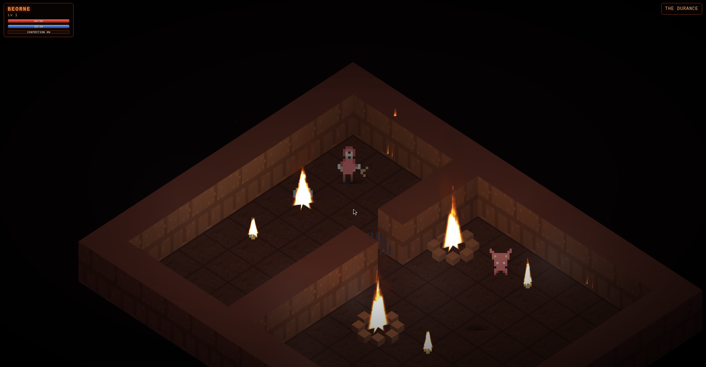

# BEORNE: Ashes of Penitence

A dark isometric web RPG — the sequel to *CRYN: The Dark Reflection*. Cast into Hell for his betrayal, Beorne wakes in a lightless cell and must escape the Durance, cross the Ashen Halls, descend into the Maw, and face the Accuser himself.

## Play it

**https://retroromrunner.github.io/beorne-ashes-of-penitence/**

Keyboard + touch controls. Progress saves automatically in the browser.

## The story

Escape the cell with a bent nail. Meet Vexna the Chained. Slay Gorm the warden, take his keys, and choose: free Vexna or leave her. Open the Ashen Gate, brave the lava fields of the Maw, and stand before the Accuser for the final judgment — and the ending you earn.

## Features

- Three isometric hell-maps: **the Durance**, **the Ashen Halls**, **the Maw**
- Turn-based combat: **Strike / Hellfire / Atone**, plus the Contrition meter and **Absolution**
- Bosses with phases: **Gorm** and **the Accuser** (with Vexna's aid, if you freed her)
- Moral choice: free Vexna the Chained or refuse — and earn the Cinder Charm
- Items, fleeing, leveling, status effects, wandering foes (Cinder Imps, Hellhounds)
- Real-time 3D atmosphere: GLSL volumetric fire, flowing lava shaders, lit smoke columns, flickering dynamic lights, embers and fog
- Procedural Web Audio ambience & sound effects
- `localStorage` save / continue, death & retry

## Controls

- **Arrows / WASD** — move
- **E / Space** — interact / confirm
- **M** — toggle music
- Mobile: virtual D-pad + A/B buttons (double-tap zoom disabled)

## Tech

Single self-contained HTML file — Three.js via CDN, custom GLSL shaders for fire/lava/smoke, no build step.

Built by retroromrunner as a tribute to classic dungeon crawlers.
